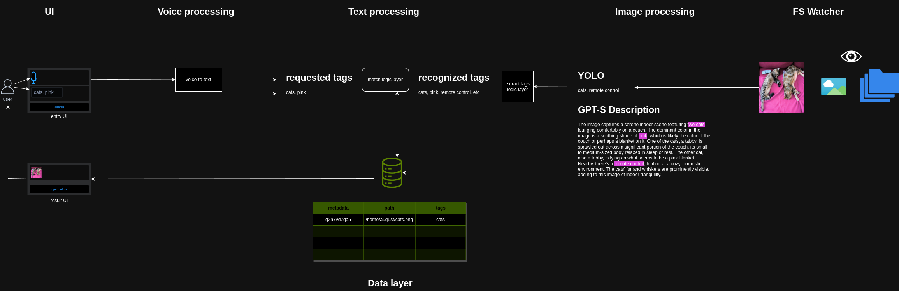

# multimodal-search

### progelan схематично накидал ТЗ

### TODO

0. **Не обосраться**
    - один раз ! 314d0р4с

1. **Обработка изображений:**
    - Написать функцию для извлечения тегов и описаний из изображений (YOLO или другой детектор объектов).
    - Написать функцию для извлечения признаков (векторных эмбеддингов) из изображений (ResNet или другая CNN-модель или другая...).

2. **Обработка аудио (не только речи?):**
    - Разработать функцию для преобразования аудио в текст (voice-to-text) с использованием обученных моделей ASR.
    - Написать функцию для извлечения признаков и описаний из аудио (wav2vec или другая модель).

3. **Обработка текстовых запросов:**
    - Написать функцию для обработки текстовых запросов с извлечением ключевых слов (???теги, семантический анализ???) Подойдет ли baloo?

4. **Слой данных (Data Layer):**
    - Создать базу данных с таблицами для мультимедийных файлов, эмбеддингов, тегов и запросов.
    - Разработать индексацию мультимедийных файлов, включая сохранение эмбеддингов, тегов и описаний.

5. **Логика соответствия (Match Logic Layer):**
    - Реализовать поиск по векторным эмбеддингам (как простые  варианты Cosine Similarity или Faiss?:D).
    - Реализовать полнотекстовый поиск по тегам и ключевым словам.
    - Сопоставить текстовые запросы с соответствующими мультимедийными признаками и тегами.

6. **Пользовательский интерфейс (UI):**
    - Написать GUI-приложение с полем поиска и областью результатов.

7. **Не обосраться**